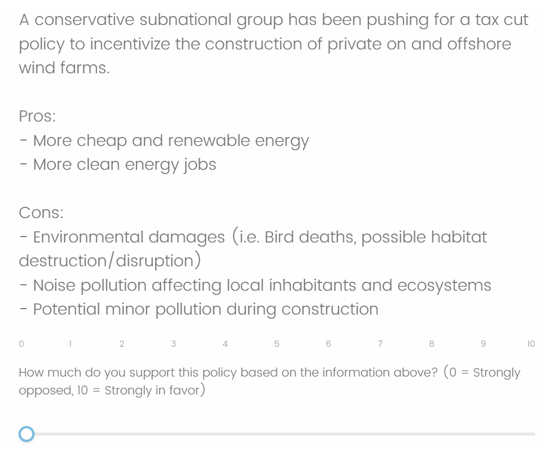
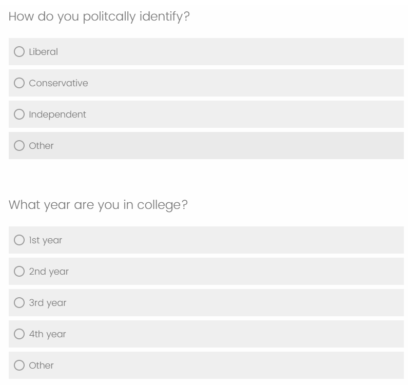

```{r setup, include=FALSE}
knitr::opts_chunk$set(echo = FALSE)
```

# Introduction

In today's world, the United States feels more split than ever with little compromise in the middle. With the expansion of social media and the role of modern politics, individuals have increasingly become more polarized, and attached to their political party. This can be problematic when it comes to policy making, where finding compromises is sometimes the only way to make progress. However, if constituents are so polarized and morally against the other party, it becomes very difficult for politicians to meet in the middle. This study aims to explore the effect of partisan ties on political opinions. Understanding how people view the same question when asked by a different party may reveal just how biased people are when it comes to partisan politics.

Specifically, the study will run an experiment on college students to determine if students in particular tend to form their opinions along party lines. College students represent some of the youngest and sometimes more politically active constituent groups. However, it is well known that on average, college students tend to lean left on many political issues, and in an environment where this is the norm, college students may form their opinions solely on the fact that everyone around them is thinking that way too. By studying political ties in colleges students, we hope to understand if young college voters tend to make their own opinions on controversial topics, or if they may resort to political associations for the best choice for them.

Previous research has found that the increased social polarization is coming from growing partisan bias, activism, and anger, which is leading to more aligned political identities (Mason, 2015). Moreover, social groups can be especially powerful in forming political identities. Kane et al. (2021) show evidence that political ideologies of a group may have just as much influence as one's own political identity. In turn, this may lead to "negative partisanship" where groups tend to disagree with the opposing party, while not necessarily agreeing with their own party (Kane et al., 2021). One topic with a particularly interesting trend is climate change and renewable energy. Research by Hamilton et al. (2018) noticed that views on climate change are closely related to partisan ties while renewable energy was a topic debated more on both sides.

Using this information, this study expands on the current research by focusing specifically on views of a California college campus in an environmentally conscious region. Views on climate change are likely to align with the liberal ideology of anthropogenic factors as the root cause, but students' opinions on renewable energy may be less consistent. Furthermore, renewable energy is a topic that has environmental benefits such as more available clean energy, but also has potential drawbacks with the increase infrastructure and development needed to build these projects (Kadar, 2014). Investigating views on renewable energy development at UC Santa Barbara will provide insight on how college students interact with a potential left leaning political college campus community that previous research has identified (Linvill and Havice, 2011), and will shed light on the effect of political group views on individual opinion. This research will specifically aim to understand if liberal college students tend to agree more with liberal perspectives and/or agree less with conservative opinions, regardless of the issue at hand.

# Methods

Data for this study was obtained through survey sampling at University of California, Santa Barbara (UCSB) using a three question survey created in Qualtrics. The first question was randomly assigned one out of three versions of the question. Each version asked the respondent to state their level of support between 0 and 10 for a hypothetical policy proposal in renewable energy infrastructure where the same pros and cons were listed. However, the beginning of the question varied between each version, where the question either stated the policy was being pushed by a "conservative subnational group", "liberal subnational group", or simply by "legislators", which acted as a control group. By just changing what political group supported this policy and keeping the rest of the question the same, the study hopes to uncover UCSB students' biases based on party ties. In other words, the study hopes to reveal the effect of "negative partisanship" as described by Kane et. al. (2021), where people disagree with the opposing party, but are not necessarily in support of their own party.

In addition to the treatment question described above, two additional questions were asked as controls. The second survey question asked respondents to report their political identification. This was important since liberals and conservatives were highly likely to respond differently to the treatment question based on their political identity. Most of students at UCSB are liberal, meaning we expected most students to report lower agreement ratings when the policy was proposed by conservative legislators, and higher agreement when the proposal was from liberal policymakers. However, a conservative student would most likely react in the opposite way, with higher agreement for conservative policy, and lower for the liberal. Respondents were allowed to pick "liberal", "conservative", "independent", or "other" for political identification. Since the final survey results did not have enough conservative respondents to make any reasonable conclusions, we chose to filter the data for only liberal responses. The third and final question asked about students' class standing. This question was designed to act as a block, to control for varying opinions between different years in college, but was not a factor of interest when analyzing the effect on response levels. Survey participants could choose from "1st year", "2nd year", 3rd year", "4th year", or "other". For the final data sample, we filtered out any "other" responses, as we did not want to consider additional sub groups, and hopefully also removed any responses from any non college students that may have gotten access to the survey.

Below are images of the survey questions. The first question (left) changes the wording between "A conservative subnational group has been", "A liberal subnational group has been", and "Subnational legislators are considering a new tax cut ...". The remaining questions were identical for all respondents. The back button was also disabled in order to prevent respondents from returning to the policy agreement question (left) after they saw the remaining questions (right).

{width="49%"} {width="49%"}

Responses were then collected in Qualtrics into a table similar to the one below. Each of the three questions on the left has one response and NA values for the other two since participants only randomly answered one of the three questions.

```{r, warning = F, message = F}
#load packages
library(ggplot2)
library(dplyr)
library(tidyr)
library(readr)

#read in data
survey_data <- read_csv("6-5_Survey.csv",
                        col_select = c(18,19,20,21,22))
```

```{r, warning = F, message = F}
# format for neat presentation
default_responses <- survey_data %>% 
  slice(-(1:6)) %>% #delete first 6 rows with irrelevant information
  rename(              #renames columns
    Political_Identity = "Q4",
    Class = "Q5",
    Conservative_Q = "Q1C_1",
    Liberal_Q = "Q2L_1",
    Control_Q = "Q3I_1"
  )             

#display first 10 default responses
knitr::kable(head(default_responses, 10))
```

This study used a Generalized Randomized Block Design (GRBD) and an analysis of variance (ANOVA) model to determine if the level of agreement for liberal college students at UCSB on a controversial question on renewable energy is affected by the political group proposing it. To do this we analyzed type of question on response level while using class standing as a control block. The null hypothesis is that the type of question (the political group proposing the policy) does not have an effect on the response level while holding class standing constant. Then, a Tukey HSD test was run for individual significance tests between question types in order to determine which questions, if any, illicit a different agreement level

In order to properly reject or fail to reject the ANOVA null hypothesis, a few assumptions must be met. First, the response levels must be normally distributed. For this experiment, it is possible that response level may not follow a normal distribution since liberal college students may tend to favor values greater than 5, which would give a right skew to the data. Conversely, responses might have a bi-modal distribution where most people are either in favor or not in favor, but not many feel neutral. Moreover, since the response levels are discrete integer values between 0 and 10, even in a large sample size, the data will never really follow a perfect normal distribution. Another assumption required for ANOVA is equal variances for each treatment group (type of question). This assumption most likely holds. However, it is also possible to imagine a situation where most liberals have consistently lower agreement levels with a conservative question since they disagree with the conservative aspect the most, but may have more mixed feelings on the question itself, which becomes more apparent when the question is coming from a political group liberals align with. Lastly, for the ANOVA model to be correct, the data must have no structure. This assumption is likely to hold as each survey and question were distributed fairly randomly. Therefore, it is unlikely that earlier observations would have different mean response levels compared to values collected later.

There were a few issues that occurred during data collection. For one, it was difficult to have perfectly randomly collected data from the population since participants self selected into the study. The survey was distributed through social media platforms Instagram, Reddit, and Yik Yak. For Instagram, the survey link was posted on the Instagram story for the account \@tony_segal where only followers of the account could view the posting. For Reddit and Yik Yak, the link was posted anonymously to groups specific to UCSB. Some additional survey links were distributed through personal group chats between friends and/or colleagues. For all distribution method, the survey was described to take "less than 30 seconds", and as "anonymous". As mentioned, all survey respondents self selected to respond to the survey, leading to potential bias in the data towards UCSB students who are more likely to complete surveys. These responses are also biased towards individuals in social circles close to me (Tony Segal), or people who spend more time on these specific social media platforms.

Some other complications that may lead to issues in the data are that it was not possible to guarantee respondents were all from UCSB. In certain situations, especially through Instagram, respondents from other institutions or age groups had access to the link, and even though the link was posted with a message requesting UCSB students only, there was no way to ensure this result. Lastly, there were a few instance were respondents did not complete all parts of the survey, but these responses were deleted since all fields were required for the data analysis.

# Results

Before collecting the data, a sample size calculation was done to estimate the required minimum sample size to have 80% power and an $\alpha = 0.05$ significance level. In order to conduct the sample size calculation, a literature review was performed to find a close guess to the mean response values for each group, the variance within each group, and the effect size (variance between groups). The article "A change in wind? US public views on renewable energy and climate compared" by Hamilton et. al. (2018) offers data very similar to the question at hand. Their study asked questions to a variety of groups, including college students, on how much they prioritized renewable energy between 0-100% (0-1), which could be easily re-scaled to fit a 0-10 scale used in our experiment. For liberal college students, which was the majority of the UCSB survey respondents, Hamilton et. al. (2018) estimated a confidence interval that seemed to be between [8.7, 9.3], or plus/minus 0.3 around a mean of 9. Then, using their sample size of 1209 and Z-score of 1.96, we could estimate a within mean variance of roughly 28. Using similar steps, lower and higher estimates of within mean variances were tested.

Using the same graph, we estimated group mean agreement levels of 6.1, 9, and 7.8 for conservatives, liberals, and independents respectively. The study above is looking at response level for different political groups using the same question, while this paper focuses on changes in responses for different questions using the same political group. Therefore, the mean value for our experiment are likely different, but we are interested in the variance between these values, not the values themselves. We use the effect size estimate from Hamilton et al. (2018) of around 2 as a starting point, but since our studies effect size is likely going to be different, we run sample size tests for a variety of effect sizes between 1 and 5 to check for best and worst case scenarios. Below are the results to our sample size calculation.

```{r}
#function takes variance as inputs and produces data frame with sample size values to graph in chart from lecture
sample_size_df_func <- function(mid, low, high){
  
  #Rough estimates for mean agreement with question for conservatives, liberals, and independents respectively
  groupmeans <- c(6.1, 9, 7.8)
  
  #estimate of possible fluctuations between means estimated above
  between.var <- seq(0.5, 5, by = 0.5)
  
  #initiate mid, low, high sample size vectors
  samplemid = c()
  samplelow = c()
  samplehigh = c()
  
  #loop through all values of possible between var mean variance
  for (var_i in between.var){
    #find sample size for i effect size and mid within variance using 80% power and 5% alpha
    output1 <-  power.anova.test(
      groups = length(groupmeans),
      between.var = var_i,
      within.var = mid,
      power = 0.8, sig.level = 0.05, 
      n = NULL
    )
    #add to vector
    samplemid = c(samplemid, output1$n)
    
    #sample size for i effect size and low within variance
    output2 <-  power.anova.test(
      groups = length(groupmeans),
      between.var = var_i,
      within.var = low,
      power = 0.8, sig.level = 0.05, 
      n = NULL
    )
    samplelow = c(samplelow, output2$n) #add to vector
    
    #i effect size, high within variance
    output3 <-  power.anova.test(
      groups = length(groupmeans),
      between.var = var_i,
      within.var = high,
      power = 0.8, sig.level = 0.05, 
      n = NULL
    )
    samplehigh = c(samplehigh, output3$n) #add to vector
  }
  
  #create data frame with sample size vectors, effect size (between_var) and within var 
  sample_size_df = data.frame(
    n = c(samplemid, samplelow, samplehigh),
    between_var = rep(between.var, 3),
    within_var = c(rep(mid, length(samplemid)),
                   rep(low, length(samplelow)),
                   rep(high, length(samplehigh))) 
  )
  
  #change to factors
  sample_size_df$within_var <-
    factor(sample_size_df$within_var, 
           levels= c(mid, low, high))
  
  #output data frame to use in ggplot
  sample_size_df
}

#From Hamilton et. al. we approximate college student renewable energy agreement
#interval of plus/minus 0.5 (on 0-10 scale) using their sample size of 1209
med <- round( (.3/1.96)^2 * 1209)
#78.67815

#make a low estimate 
low <- round( (.15/1.96)^2 * 1209)
# 19.66954

#make a high estimate
high <- round( (.4/1.96)^2 * 1209)
#78.67815

#Run calculation with different within treatment group variation estimates from Hamilton et. al.
sample_size_df <- sample_size_df_func(med, low, high)

#plot results from function data frame
ggplot(data = sample_size_df,
       mapping = aes(x = between_var, y = n,
                     group = within_var, 
                     color = within_var)) +
  geom_point() + geom_line() +
  labs(
    title = "Possible Sample Sizes",
    subtitle = "(For 80% power and 5% confidence level)",
    y = "Required Sample Size (n)",
    x = "Between Mean Variance Estimates (Effect Size)",
    color = "Within Treatment Group Variation"
  )
```

In the best case within question variation scenario, we would need no more than around 75 samples for even the worst case effect size. But for the absolute worst case scenario for effect size and within group variation, we might need almost 500 observations. With the time and resources provided, it was only feasible to reach 100-200 responses which would still be a reasonable sample size for most effect sizes and within group variations. From UCSB students, we collected 161 observations, but after filtering for students not between 1-4th years, students who were not liberal, or respondents that returned an incomplete survey, our final sample size was 93. This is sufficient for all effect sizes in best case within treatment scenario, and most effect sizes in the mid to high within group variance scenarios.

After collecting the data, we plotted the results as a boxplot and jitterplot grouped by class, and then a boxplot for just the different question types.

```{r, fig.show = "hold", out.width = "50%"}
#manipulate to clean and get into aov formatting
survey <- survey_data %>% 
  pivot_longer(
    cols = c("Q1C_1", "Q2L_1", "Q3I_1"),
    names_to = "question",
    values_to = "response",
    values_drop_na = TRUE    #drops null responses 
  ) %>% 
  slice(-(1:6)) %>% 
  rename(              #renames columns
    polV = "Q4",
    class = "Q5"
  ) %>% 
  # remove 'other' responses, and just keep liberal
  filter(!is.na(polV), polV == "Liberal", class != "Other") %>% 
  #change to factors, and re-level reference category
  mutate(response = as.numeric(response),
         question = relevel(as.factor(question),
                            ref = "Q3I_1"),
         class = as.factor(class),
         question = recode(question,
                           "Q3I_1" = "Control",
                           "Q1C_1" = "Conservative",
                           "Q2L_1" = "Liberal"))

#plot jitter plot, (offset points)
ggplot(data = survey, aes(y=response, x=question, color = class)) + 
  geom_jitter(width = 0.2, height = 0) + 
  scale_color_manual(values = c("1st year" = "blue", "2nd year" = "red", "3rd year" = "forest green", "4th year" = "yellow")) + 
  scale_y_continuous(breaks = seq(0,10, by = 1)) +
  labs(
    title = "Jitter Plot: Agreement Level by Question Type and Class Standing",
    x = "Question Type",
    y = "Agreement Level",
    color = "Class Standing"
      )

#plot boxplot
ggplot(data = survey, aes(y=response, x=question, fill = class)) + 
  geom_boxplot() + 
  scale_fill_manual(values = c("1st year" = "blue", "2nd year" = "red", "3rd year" = "forest green", "4th year" = "yellow")) + 
    scale_y_continuous(breaks = seq(0,10, by = 1)) +
  labs(
    title = "Box plot: Agreement Level by Question Type and Class Standing",
    x = "Question Type",
    y = "Agreement Level",
    fill = "Class Standing"
      )
```

```{r}
#plot boxplot not grouped by year in college
ggplot(data = survey, aes(y=response, x=question)) + 
  geom_boxplot() + 
  #scale_x_discrete(labels = c("Q3I_1" = "Control", "Q1C_1" = "Conservative", "Q2L_1" = "Liberal")) + 
  scale_y_continuous(breaks = seq(0,10, by = 1)) +
  labs(
    title = "Box plot: Agreement Level by Question Type and Class Standing",
    x = "Question Type",
    y = "Agreement Level",
      )
```

When looking at class standing as well as question type, there are no obvious differences in agreement level. For unclear reasons, 2nd years tended to respond lower than most. Another notable subtle pattern is in the liberal question where as liberal students progress through college, they appear to agree more with the liberal question (with the slight exception of 2nd years). There is not enough evidence to make conclusions with this survey data, but further studies could look into this pattern.

When analyzing the boxplots without grouping by class, it is easier to notice differences in the data. All the medians are close, but the conservative values tend to be slightly lower than the liberal values. The table below displays some quick summary statistics on the data grouped by type of question.

```{r}
#summary table for means, var, and sample sizes
summary <- survey %>% 
  group_by(question) %>% 
  summarize(mean = mean(response),
            var = var(response),
            n = n())

knitr::kable(summary)
```

The mean for the conservative question is noticeably lower than the means for the control and liberal question which are about the same. The within group variances are about 4-7 and the effect size is `r var(c(summary$mean))` which, according to the sample size calculation, will give us sufficient power. The variances are also slightly different, which may result in an incorrect ANOVA p-value, but further model checking is required which will be done below.

As mentioned in the methods, for our GRBD we use an ANOVA model to check if our results are significant. The output for our ANOVA calculations are below:

```{r}
#ANOVA model output
model <- aov(response ~ question + class, 
             data = survey)
knitr::kable(summary(model)[[1]])
```

After conducting an ANOVA calculation using class as block controls, the p-value is `r summary(model)[[1]][1,5]`. Therefore, we fail to reject that type of question has an affect on the response rate. In other words, our experiment is unable to conclude that changing the political group proposing a policy change has any effect on liberal UCSB students' level of support.

Next we run a Tukey test to make pairwise comparisons between questions types and check for significance. Since the ANOVA p-value was not significant, we do not expect any of the pairwise p-values to be significant.

```{r}
#Pairwise comparisons with Tukey test
tukey <- TukeyHSD(model)
knitr::kable(tukey$question)
```

As expected, none of the pairwise comparisons have any significant difference at $\alpha = 0.05$, but the largest difference is between the conservative and liberal group which what we expected.

In order to correctly interpret the ANOVA output, the normality, equal variances, and no structure assumptions must be met. Below we run some tests to confirm the data meets these requirements using ANOVA residuals.

```{r, fig.show = "hold", out.width = "50%"}
#ANOVA residuals
Residuals <- model$residuals

#Histogram for normality check
hist(Residuals,
     main = "Histogram of Residual Response Values")

#qqplot for normality check
qqnorm(Residuals)
qqline(Residuals)
```

Looking at the residual values histogram, the distribution looks roughly normal, although there does appear to be a very slight right skew. The qq normality plot appears roughly normal as well.

```{r}
#Shaprio-Wilk test for normality check
SW <- shapiro.test(Residuals)
```

Shapiro-Wilk Normality Test p-value: `r SW$p.value`

The Shapiro-Wilk normality test p-value is high enough where we fail to reject the null hypothesis that the distribution is normal. However, a p-value of `r SW$p.value` is still a little low and raises some suspicion that the distribution may not be normal.

```{r, fig.show = "hold", out.width = "50%"}
#Residuals over fitted for equal variance check
plot(Residuals ~ model$fitted.values,
     main = "Residuals over ANOVA Fitted (predicted) Response Values",
     xlab = "Fitted Values")


#add index to survey for order of data collection
survey$index <- seq_len(nrow(survey))

#plot Residuals on order for structure check
plot(Residuals ~ survey$index,
     main= "Residual Response Values over Order of Collection",
     xlab = "Collection Order")
```

Looking at the residuals over fitted values plot, the variances for each fitted value appear to be different. Some points are grouped together while others are spread out more. This plot suggests that the variances may be unequal and could be leading to a incorrect ANOVA model.

The residuals over collection order plot shows data that does not seem to follow any order. This is good, and to be expected since data was collected randomly over time.

Since we cannot confidently say the normality and equal variances assumptions are met in this experiment, we run an ANOVA permutation test just to confirm our ANOVA results are robust.

```{r, cache = TRUE}
#initiate permutation F values
perm_f <- NA

#number of repetitions for loop
reps <- 10000

#loop many times and shuffle for new f value
for(i in 1:reps){
  surv_perm <- survey
  surv_perm$response <- sample(surv_perm$response) #shuffle
  perm_f[i] <- summary(aov(response ~ question + class, data = surv_perm))[[1]][1,4] 
  #save F-staistic from shuffled values
}

#calculated original F-statistic
F_val <- summary(model)[[1]][1,4]

#calculated number of shuffled F-statistics at least as extreme as original for p-value
perm_p <- sum(perm_f >= F_val) / reps
```

The permutation test p-value is `r perm_p` which is very similar to the ANOVA p-value. Our conclusion remains the same, and the p-values being similar suggests our model assumptions are appropriately met.

# Discussion

This study runs an experiment on UCSB liberal undergraduate students to check if the political group suggesting a policy change has an effect on the level of agreement from students. After analyzing the data, we fail to reject our null hypothesis that all of the question types have the same effect on response values. In other words, according to the data, there is likely no difference between agreement levels based on the political group suggesting a policy.

The results from this experiment are meant to contribute to understanding how people's political views lead to biases in their support for certain controversial topics. We came into this study expecting liberal college students to agree more with a policy suggested by liberal policy makers, and much less with a policy suggested by conservatives. The idea was liberal college students might have a tendency to agree with whatever their political party proposes and this effect would overpower their actual unbiased preference for the policy. Conversely, we expected liberal students to on average disagree more when the policy was proposed by conservative policymakers, regardless of their true opinion on the policy. This study did not find a significant effect in either of these areas, but result may still be of use.

The results from this study actually have a more optimistic view on political polarization than this study initially expected. UCSB liberal college students seem to not demonstrate any strong level of partisan bias to a controversial question on renewable energy. The results suggest that on average, these students have their own opinion on renewable energy, and their position is not positively or negatively affected by which political party is suggesting the policy. Conducting this study on college students is particularly interesting since this is one of the youngest group of voters, and they may still be voting based on their parent's political preference, without forming their own political opinions. On the other hand, college students tend to be more politically active and educated on current events, leading them to be more likely to form their own opinion on policy issues regardless of partisanship. This study lacks evidence to support either claim, but the results tend to side with the latter. Any claim on college students in general would require a study on all political perspective on campus and should study multiple universities. This study focuses on a very specific subgroup, but the lack of statistically significant results for our research question could be explained by college students forming their own opinions, regardless of partisan ties.

This study deals with a few issues when applying the results to broader populations. As mentioned in the previous paragraph, this study focuses on a specific subgroup of liberal college students at UC Santa Barbara. Furthermore, of this subgroup, this study sampled primarily from users of Reddit, Yik Yak, and Instagram followers of \@tony_segal. Participants also self selected into the study meaning this study is biased towards students who like to respond to surveys.

Another issue that may have occurred in our sampling is that levels of agreement will depend greatly on the way the policy issue is proposed or worded. Asking the same question to each treatment group mostly controls for this, but it is possible to imagine a situation where the issue proposed is generally favorable, creating a more objective answer that is influenced less by opinion. The opposite is also true where a question may be worded in a way that leads most people to disagree. This may be especially of concern if there is a moral or ethical consideration in the question that pushes people's agreement levels in one direction and is less based on their political bias. The question asked was carefully worded with persuasive pros and cons for both sides. The goal was to center mean agreement levels around 5 to have a roughly normal distribution with some responses below and some above. Based on the means in the results this appears to be mostly true, and responses did not tend to be overwhelmingly biased in either directions.

The results in our study did not lead to any statistical conclusions, however, this still contributes to an interesting discussion on whether liberal college students display partisan bias when it comes to controversial topics. The lack of evidence to reject our null hypothesis could be explained by the fact that these students generally form their own opinions and are not so fundamentally loyal to their political party of preference. The lack of robust results also fails to support Linvill and Havice (2011) which argue there is left leaning bias created by college campuses. Further research should be conducted on other campuses and all political perspectives, but these results suggest a more optimistic outlook on the increasingly polarized politics that we see today, where the younger generation might be moving away from loyal party ties, and more towards creating a personal opinion on controversial issues.

# References

Hamilton, L. C., Bell, E., Hartter, J., & Salerno, J. D. (2018). A change in the wind? US public views on renewable energy and climate compared. *Energy, Sustainability and Society*, 8(1), 1-13.

Kádár, P. (2014). Pros and cons of the renewable energy application. *Acta Polytechnica Hungarica*, 11(4), 211-224.

Kane, J. V., Mason, L., & Wronski, J. (2021). Who's at the party? Group sentiments, knowledge, and partisan identity. *The Journal of Politics*, 83(4), 1783-1799.

Linvill, D. L., & Havice, P. A. (2011). Political bias on campus: Understanding the student experience. *Journal of College Student Development*, 52(4), 487-496.

Mason, L. (2015). "I disrespectfully agree": The differential effects of partisan sorting on social and issue polarization. *American journal of political science*, 59(1), 128-145.